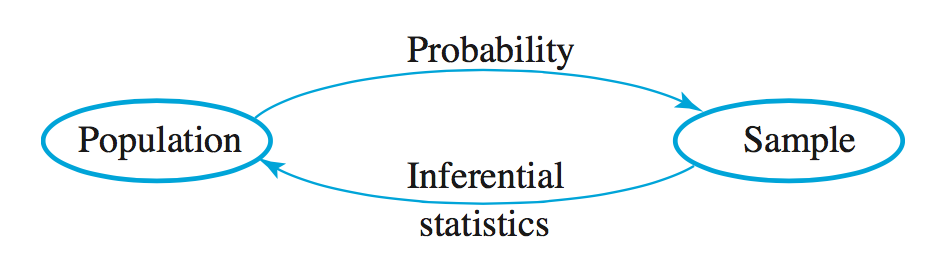

```{r,echo=FALSE,message=FALSE,warning=FALSE}
library(formatR)
library(tidyverse)
library(kableExtra)

# Set so that long lines in R will be wrapped:
knitr::opts_chunk$set(tidy.opts=list(width.cutoff=80), tidy=FALSE)
knitr::opts_chunk$set(cache=TRUE,warning=F)
knitr::opts_chunk$set(out.height='40%',fig.align = "center")
add.space = 0

# kable table global setup
kt = function(data) {
  kable(data, align = "c", escape = FALSE) %>%
    kable_styling(bootstrap_options = c("striped"),
                  latex_options = c("hold_position"))
}
```

# Basic Concepts of Statistics

*In this chapter, we'll introduce some of the basic concepts and definitions that are fundamental to the study of Probability and Statistics. In particular, sampling and sample statistics will be examined.*

## Populations, Samples, and Processes

:::{.definition}
A ***population*** is a well-defined complete collection of objects.
:::


:::{.definition}
A ***sample*** is a subset of the population.
:::


:::{.definition}
A ***population parameter***  is a numerical value that describes a characteristic of a population.
:::

:::{.definition}
A ***sample statistic*** is a numerical value that describes a characteristic of a sample.
:::


:::{.example}
A student is interested in the average grade point average (GPA) of CSU students. She collects the GPAs of eight friends and finds an average of 2.87. For this example, determine the population, sample, parameter, and statistic.
:::

$~$

```{r, echo =F}
# ```{r, echo=F, out.width='2in',fig.align='right'}

# Define the size of the box and the circle
box_size = 10
circle_radius = 3

# Create a data frame for the circle
circle = data.frame(
  x = circle_radius * cos(seq(0, 2 * pi, length.out = 100)) + box_size / 2,
  y = circle_radius * sin(seq(0, 2 * pi, length.out = 100)) + box_size / 2
)

# Create the plot
ggplot() +
  # Draw the box
  geom_rect(aes(xmin = 0, xmax = box_size, ymin = 0, ymax = box_size),
            fill = "white", color = "black") +
  # Draw the circle
  geom_polygon(data = circle, aes(x = x, y = y), fill = "white", color = "black") +
  # Set the aspect ratio to 1:1
  coord_fixed() +
  # Remove axes and labels
  theme_void() +
  labs(title="Illustration of Population and Sample") +
  theme(plot.title = element_text(hjust = 0.5))
```

$~$

$~$

$~$

$~$

## Methods of Collecting a Sample

:::{.definition}
***Simple Random Sampling (SRS)*** is a basic sampling method used in statistics where every individual or element in a population has an equal chance of being selected. This method ensures that the sample is unbiased.
:::

:::{.example}
Suppose we want to collect a simple random sample of CSU student GPAs. How might we do this?
:::

<!--\vfill -->
$~$

$~$

$~$

$~$

:::{.definition}
***Convenience Sampling*** is a sampling method where the sample is taken from a group of people that are easy to reach or readily available. This method relies on selecting individuals who are most conveniently accessible to the researcher, rather than using a random or systematic approach.
:::

:::{.example}
Suppose we want to collect a convenience sample of CSU student GPAs. How might we do this?
:::

<!-- \vfill -->
$~$

$~$

$~$

$~$

:::{.definition}
***Stratified Sampling*** is a probability sampling method where the population is divided into distinct subgroups or "strata" that share similar characteristics, and a random sample is then taken from each stratum. This approach ensures that each subgroup is adequately represented in the final sample, leading to more precise and reliable estimates.
:::

:::{.example}
Suppose we want to collect poll data for the presidential election for 250 voters. Further, suppose a recent poll found that 36\% of voters are registered with the Democratic Party, 31\% of voters are registered with the Republican Party, and 33\% are not registered for either major party. How might we collect a stratified sample and what's the advantage compared to SRS?
:::

<!-- \vfill -->
$~$

$~$

$~$

$~$


**Note:** While there are many other more complex techniques to sample, we'll generally assume that any sample collected in this class is a simple random sample.


<!-- %\newpage -->

Data can be either collected in an ***observational study*** or in an ***experiment***.

:::{.definition}
In an ***observational study***, data is collected without manipulating the environment or influencing how the data naturally occur.
:::

:::{.example}
How might one collect data to investigate a connection between smoking and cancer?
:::

<!-- \vfill -->
$~$

$~$

$~$

$~$

:::{.definition}
In an ***experiment***, participants are assigned to different treatment groups to determine if the treatment causes changes in the outcome. A key component is the ***control group***, where participants receive no treatment or a standard one, serving as a baseline for comparison. This setup helps establish causality by isolating the effect of the treatment from other variables.
:::

:::{.example}
Why might it be difficult to conduct a controlled experiment investigating smoking and cancer?
:::

<!-- \vfill -->
$~$

$~$

$~$

$~$

:::{.example}
Suppose we want to set up a controlled experiment to investigate the efficacy of a new blood pressure reduction drug. We begin by randomly sampling 100 people with high blood pressure. How would we set up a controlled experiment?
:::

<!-- \vfill -->
$~$

$~$

$~$

$~$

In addition to the sampling method, bias may still occur if participants in an experiment are aware of the treatment they are receiving. This awareness can influence their behavior or responses, potentially skewing the results.

:::{.example}
20 patients are being treated for depression, half are given an antidepressant and half are given a sugar pill (\underline{placebo}). Suppose the patients know which pill they have been given. How might this cause the results to be biased?
:::

<!-- \vfill -->

<!-- \newpage -->

$~$

$~$

$~$

$~$

:::{.definition}
***Blinded Experiments***

A ***blinded experiment*** is an experiment in which participants do not know which treatment they are receiving.

A ***double-blinded experiment*** is an experiment in which both the participants and the researchers do not know which treatment is being administered during the experiment.

A ***triple-blinded experiment*** is an experiment in which the participants, the researchers, and the analysts evaluating the data are all unaware of which treatment is being administered. This approach further reduces the potential for bias at all stages of the experiment.
:::

## Types of Data

We will break data into two categories: **quantitative** and **qualitative**.

:::{.definition}
***Quantitative data*** is numeric data or numbers and can broken into two further categories, ***discrete*** and ***continuous***.

***Discrete data*** is quantitative data with a finite or countably infinite number of values.

***Continuous data*** is quantitative data with an uncountably infinite number of values or data taken from an interval.
:::

:::{.example}
Give examples of discrete and continuous data.
:::

<!-- \vfill -->
$~$

$~$

$~$

$~$

:::{.definition}
***Qualitative data*** refers to names, categories, or descriptions and can also be broken down into two further categories, ***nominal*** and ***ordinal***.

***Nominal data*** is qualitative data with no natural ordering.

***Ordinal data*** is qualitative data with a natural ordering.
:::


:::{.example}
Give examples of nominal and ordinal data.
:::

<!-- \vfill -->
$~$

$~$

$~$

$~$

<!-- \newpage -->


## Summarizing Qualitative Data

While we will mostly focus on quantitative data in this class, there are a few simple methods for describing qualitative data that you should be aware of.\\

:::{.example}
Let's collect some data on eye color from members of the class and then explore some statistical and graphical summaries.

Data:

:::

\bigskip

***Frequency Table*** \hfill 
***Bar Graph*** \hfill
\hfill

\vfill
\vfill
\vfill

***Proportions:*** $p=\frac{\#\text{ in category}}{\#\text{ total}}$

\indent What proportion are brown?

\vfill

***Percentages:*** $P\% = p \cdot 100$

What percentage are blue?
\vfill

\newpage

## Visualizing Quantitative Data

:::{.definition}
A ***histogram*** visualizes the distribution of a dataset by grouping data into bins and plotting the frequency of data points in each bin. The x-axis represents the data range, and the y-axis shows the frequency of occurrences. Histograms are useful for understanding the shape, central tendency, and spread of data.
:::

:::{.example}
14 students were randomly sampled and were asked how many credits they are taking this semester.

Data: 12, 14, 15, 12, 9, 18, 22, 15, 16, 14, 14, 12, 3, 17
:::

```{r,echo=F}
data = data.frame(
  c("Class","Frequency","Relative Frequency","Percentage Frequency"),
  c("$[0,3)$",rep("",3)),
  c("$[3,6)$",rep("",3)),
  c("$[6,9)$",rep("",3)),
  c("$[9,12)$",rep("",3)),
  c("$[12,15)$",rep("",3)),
  c("$[15,18)$",rep("",3)),
  c("$[18,21)$",rep("",3)),
  c("$[21,24)$",rep("",3)),
  c("Total",rep("",3))
)
names(data) = NULL
data = t(data)


# data = data.frame(
#   c("Class","Frequency","Relative Frequency","Percentage Frequency"),
#   c("$0 \\le x < 3$",rep("",3)),
#   c("$3 \\le x < 6$",rep("",3)),
#   c("$6 \\le x < 9$",rep("",3)),
#   c("$9 \\le x < 12$",rep("",3)),
#   c("$12 \\le x < 15$",rep("",3)),
#   c("$15 \\le x < 18$",rep("",3)),
#   c("$18 \\le x < 21$",rep("",3)),
#   c("$21 \\le x < 24$",rep("",3)),
#   c("Total",rep("",3))
# )
# 
# names(data) = NULL
# data = t(data)

# Render the table
kt(data)
```

***Histogram***

```{r,echo=F,out.height="30%"}


# Create an empty data frame
empty_data = data.frame(x = numeric(0), y = numeric(0))

# Create the plot
ggplot(empty_data, aes(x = x, y = y)) +
  # Set the limits for x and y axes
  scale_x_continuous(name = "credits", limits = c(0, 27), breaks = seq(0, 24, by = 3)) +
  scale_y_continuous(name = "freq", limits = c(0, 7), breaks = seq(0, 6, by = 1)) +
  # Add x and y axis lines with arrows
  geom_segment(aes(x = 0, xend = 27, y = 0, yend = 0), 
               arrow = arrow(length = unit(0.1, "cm"), type = "closed"), 
               color = "black", linewidth = 1) +   # Use linewidth instead of size
  geom_segment(aes(x = 0, xend = 0, y = 0, yend = 7), 
               arrow = arrow(length = unit(0.1, "cm"), type = "closed"), 
               color = "black", linewidth = 1) +   # Use linewidth instead of size
  # Hide any points or lines (since there's no data)
  geom_blank() +
  # Ensure the plot has minimal theme
  theme_minimal() +
  theme(
    panel.grid.minor = element_blank(),  # Remove minor grid lines
    axis.ticks = element_blank(),        # Remove axis ticks
    panel.grid.major.x = element_line(color = "grey80"),  # Keep major grid lines on x-axis
    panel.grid.major.y = element_line(color = "grey80")   # Keep major grid lines on y-axis
  )

```

<!-- \newpage -->

```{r,echo=F}
set.seed(2023)
library(dplyr)

require(gridExtra)
nsims = 100000

uni1 = rnorm(n=nsims,mean=100,sd=15)

uniplot1 = data.frame(Scores = uni1) %>% 
  ggplot(aes(x=Scores)) +
  geom_histogram(bins=40) +
  labs(x="Score",
       title="IQ Test Scores") +
  theme_minimal(base_size = 10)

uni2 = rexp(n=nsims,rate = 1/2)

uniplot2 = data.frame(`Minutes` = uni2) %>% 
  ggplot(aes(x=`Minutes`)) +
  geom_histogram(bins=100) +
  labs(x="Minutes",
       title="Minutes Late for Class") +
  theme_minimal(base_size = 10)

bi1 = c(rnorm(n=nsims,mean=64,sd=2),rnorm(n=nsims,mean=69,sd=2))

biplot1 = data.frame(`Heights` = bi1) %>% 
  ggplot(aes(x=`Heights`)) +
  geom_histogram(bins=100) +
  labs(x="Height (in inches)",
       title = "Heights of American Adults") +
  theme_minimal(base_size = 10)

norm1 = rnorm(n=nsims,mean=3510,sd=385)

normplot1 = data.frame(`Weights` = norm1) %>% 
  ggplot(aes(x=`Weights`)) +
  geom_histogram(bins=100) +
  labs(x="Weights (in grams)",
       title = "Birth Weights of Infants Born Full-Term") +
  theme_minimal(base_size = 10)

options(scipen = 999)
skew1 = 900000*rbeta(n=nsims,shape1=2,shape2=20)

skewplot1 = data.frame(`Salaries` = skew1) %>% 
  ggplot(aes(x=`Salaries`)) +
  geom_histogram(bins=100) +
  labs(x="Salaries (in dollars)",
       title = "Employee Salaries at a Company") +
  theme_minimal(base_size = 10)

skew2 = rbeta(n=nsims,shape1=6,shape2=2)

skewplot2 = data.frame(`Attendance` = skew2) %>% 
  ggplot(aes(x=`Attendance`)) +
  geom_histogram(bins=100) +
  labs(x="Class Attendance",
       title = "Class Attendance") +
  scale_x_continuous(labels = scales::percent,limits = c(0,1)) +
  theme_minimal(base_size = 10)

symplot1 = data.frame(Scores = uni1) %>% 
  ggplot(aes(x=Scores)) +
  geom_histogram(bins=40) +
  labs(x="Score",
       title="IQ Test Scores") +
  theme_minimal(base_size = 10)

sym2 = sample(x=1:6,size=nsims,replace = T) + sample(x=1:6,size=nsims,replace = T)
symplot2 = data.frame(`Sum` = sym2) %>% 
  ggplot(aes(x=as.factor(Sum))) +
  geom_bar() +
  labs(x="Sum",
       title = "Sum of Two Dice Rolls") +
  theme_minimal(base_size = 10)

sym3 = c(rbeta(n=nsims,shape1=8,shape2=1),rbeta(n=nsims,shape1=1,shape2=8))
symplot3 = data.frame(`Politics` = sym3) %>% 
  ggplot(aes(x=Politics)) +
  geom_histogram(bins=100) +
  labs(x="Political Ideology Rating",
       title = "Political Ideology Ratings") +
  theme_minimal(base_size = 10)
```


**Histogram shapes**

**1. Unimodal**

```{r,echo=F,out.height="40%"}
grid.arrange(uniplot1,uniplot2,ncol=2)
```

\vfill

**2. Bimodal**

```{r,echo=F,out.height="40%"}
biplot1
```

\vfill

\newpage

**3. Bell-shaped**

```{r,echo=F,out.height="40%"}
normplot1
```

\vfill

**4. Positively (right) skewed - tail is on the right**

```{r,echo=F,out.height="40%"}
skewplot1
```

\vfill

\newpage

**5. Negatively (left) skewed - tail is on the left**

```{r,echo=F,out.height="40%",warning=F}
skewplot2
```

\vfill

**6. Symmetric**

```{r,echo=F,out.height="40%"}
grid.arrange(symplot1,symplot2,symplot3,ncol=3)
options(scipen=0, digits=7)
```

\vfill

\newpage

**Box Plots**

:::{.definition}
A ***box plot***, or box-and-whisker plot, visualizes data distribution using a five-number summary: minimum, first quartile, median, third quartile, and maximum [more on these later]. The box shows the interquartile range (IQR), and the whiskers extend to values within 1.5 times the IQR. Outliers are plotted as individual points. Box plots are useful for comparing distributions and spotting outliers.
:::

```{r,echo=F,out.height="30%"}
set.seed(123)  # For reproducibility
data = c(rnorm(98), -3, 3)  # Example data

# Create the horizontal boxplot
boxplot(data, 
        main = "",          # Remove the title
        ylab = "",          # Remove y-axis label
        xlab = "",          # Remove x-axis label
        col = "white",      # White box color
        border = "black",   # Black border for the box
        axes = FALSE,       # Remove axis lines and numbers
        horizontal = TRUE)  # Make the boxplot horizontal

# Calculate the five-number summary
summary_stats = fivenum(data)
min_val = summary_stats[1]
q1_val = summary_stats[2]
median_val = summary_stats[3]
q3_val = summary_stats[4]
max_val = summary_stats[5]

# Add labels for the key statistics, rotated 90 degrees
text(y = 1.25, x = min_val, labels = "Min", adj = 0, srt = 90)
text(y = 1.25, x = q1_val, labels = "Q1", adj = 0, srt = 90)
text(y = 1.25, x = median_val, labels = "Median", adj = 0, srt = 90)
text(y = 1.25, x = q3_val, labels = "Q3", adj = 0, srt = 90)
text(y = 1.25, x = max_val, labels = "Max", adj = 0, srt = 90)

# Draw a border around the plot
box()
```

:::{.example}
Here are some examples of box plots.
:::

```{r,echo=F,out.height="20%"}
boxplot(uni1,main="Distribution of IQ Scores",ylab="Scores")
boxplot(uni2,main="Distribution of Minutes Late",ylab="Minutes Late")
```

\newpage

## Summary Statistics for Quantitative Data

:::{.example}
For the following exercises, we will use the following data set. The heights of five students are measured to be (in cm): 183, 165, 165, 175, 187.
:::

**Notation:** $\sum_{i=1}^n x_i = x_1 + x_2 + ... + x_n$ 

:::{.example}
What is $\sum x_i$, the sum of all heights in the sample?
:::

<!-- \vfill -->
$~$

$~$

$~$

$~$


There are many ways to measure the ``center" of our data set. We will look at mean, median, and mode.


:::{.definition}
The ***sample mean*** (or ***sample average***) $\bar{x}$ is given by: \(\bar{x} = \frac{\sum_{i=1}^n x_i}{n}\).
:::

:::{.example}
What is the sample mean of the original heights data set, $\bar{x}$?
:::

<!-- \vfill -->
$~$

$~$

$~$

$~$

:::{.definition}
The ***sample median*** $\tilde{x}$ is obtained by first ordering the $n$ observations from smallest to largest and then calculated by the following:\\

\[
\tilde{x} =
\begin{cases}
\mbox{the single middle value if $n$ is odd}, & \tilde{x} = x_{(n+1)/2} \\
\mbox{the average of the two middle values if $n$ is even}, & \tilde{x} = ( x_{n/2} + x_{n/2 + 1 })/2
\end{cases}
\]

\textit{where $x_i$ is the $i^\text{th}$ smallest value in the data set.}
:::

\newpage

:::{.example}
What is the sample median of the heights data set, $\tilde{x}$?
:::

<!-- \vfill -->
$~$

$~$

$~$

$~$

:::{.example}
If we measure an additional person at 174cm, what is the new median of the data set?
:::

<!-- \vfill -->
$~$

$~$

$~$

$~$

:::{.definition}
The ***sample mode*** is the most commonly occurring data point.
:::

:::{.example}
What is the sample mode of the heights data set?
:::

<!-- \vfill -->
$~$

$~$

$~$

$~$

**Measures of Variability**

There are a few different ways to describe the variability of a data set, including range, variance, standard deviation, and interquartile range.

:::{.definition}
The ***range*** of a data set is the difference between the largest and the smallest values.
:::

:::{.example}
What is the range of the heights data set?
:::

<!-- \vfill -->
$~$

$~$

$~$

$~$

\newpage
Typically, the most common method for measuring the spread of a data set is variance or standard deviation.

:::{.definition}
The ***sample variance***, denoted by $s^2$, is given by: 

\(s^2 = \sum_{i=1}^n\frac{(x_i - \bar{x})^2}{n-1}\)
:::

:::{.definition}
The ***sample standard deviation***, denoted by s, is given by: 

$s = \sqrt{s^2} = \sqrt{\sum_{i=1}^n\frac{(x_i - \bar{x})^2}{n-1}}$
:::

:::{.example}
Using the heights data set, calculate the sample variance and standard deviation.
:::

```{r, echo=F}
library(knitr)

# Create the data frame
data = data.frame(
  i = c("i", 1, 2, 3, 4, 5, "$\\Sigma$"),
  x_i = c("$x_i$", rep("", 5), ""),
  `x_i - \\bar{x}` = c("$x_i - \\bar{x}$", rep("", 5), ""),
  `(x_i - \\bar{x})^2` = c("$(x_i - \\bar{x})^2$", rep("", 5), "")
)
names(data) = NULL
data = t(data)

kt(data)
```

<!-- \vfill -->
$~$

$~$

$~$

$~$

:::{.definition}
The ***z-score*** measures the number of standard deviations an observation is from the mean: \(z_i = \frac{x_i-\bar{x}}{s}\)
:::

:::{.definition}
A ***percentile*** is a measure of relative standing. The $p^{th}$ percentile is the number where at least p\% of the data values are less than or equal to this number.
:::

**Special percentiles:**

1. $25^{th}$ percentile = 1$^{st}$ quartile = $Q_1$
2. $50^{th}$ percentile = 2$^{nd}$ quartile = $Q_2$ = median
3. $75^{th}$ percentile = 3$^{rd}$ quartile = $Q_3$ 


\fbox{
    \parbox{0.86\textwidth}{
Computing Quartiles

1. Order the list of data values from smallest to largest

2. Compute the median. This is $Q_2$.

3. Split the data in half at the median. If there are an odd number of data values, the median is included in neither half.

4. $Q_1$ is computed by finding the median of the lower half.

5. $Q_3$ is computed by finding the median of the upper half.
}
} \bigskip

\newpage

:::{.example}
Calculate $Q_1$ and $Q_3$  of the heights data set.
:::

<!-- \vfill \vfill -->
$~$

$~$

$~$

$~$

:::{.definition}
The ***interquartile range (IQR)*** is a measure of statistical dispersion, representing the difference between the first quartile (Q1) and the third quartile (Q3). It captures the range of the middle 50% of the data, indicating the spread of the central portion of the dataset. It is given by: $Q_3 - Q_1$.
:::

:::{.example}
Calculate IQR for the heights data set.
:::

<!-- \vfill -->
$~$

$~$

$~$

$~$

:::{.definition}
An ***outlier*** is a data point that lies far outside of the normal range of the rest of the data.
:::

**Rule of thumb:** Data points smaller than $Q_1 - 1.5 \cdot IQR$ or larger than $Q_3 + 1.5 \cdot IQR$ are outliers.


:::{.definition}
The ***five-number summary*** is a statistical description of a dataset, consisting of the minimum, first quartile (Q1), median (Q2), third quartile (Q3), and maximum. It provides a quick overview of the data's distribution, highlighting its center and spread.
:::

The five numbers are: minimum, $Q_1$, median, $Q_3$, maximum.

:::{.example}
What is the five number summary for the heights data set?
:::

<!-- \vfill -->
$~$

$~$

$~$

$~$

\newpage

## Notation for Population Parameters and Sample Statistics

Some care must be given when reporting a mean, variance, or standard deviation, as it is more important to distinguish between population and sample.

```{r,echo=F}
data = data.frame(
  c("","Mean","Median","Variance","Standard Deviation"),
  c("Population","$\\mu$","$\\tilde{\\mu}$","$\\sigma^2$","$\\sigma$"),
  c("Sample","$\\bar{x}$","$\\tilde{x}$","$s^2$","$s$")
)
data = t(data); rownames(data) = NULL

kt(data)
```

## Descriptive Statistics vs. Inferential Statistics

After a sample is taken, there are a variety of ways to describe the sample. This is the realm of ***Descriptive Statistics***. We can describe our sample with numbers (statistics) or pictorially.

Later in the semester, we will examine ***Inferential Statistics***. In Inferential Statistics, our goal is to use characteristics of a sample to say something about the full population (see Inferential Statistics).

**Connection between Probability and Statistics**

```{r, echo=FALSE, out.width='80%', fig.align='center'}

```

If we know the characteristics of a population, the study of Probability will help us determine the likelihood that a sample will have certain characteristics.

Likewise, Statistics can potentially help us use the characteristics of a sample to say something about the population.


\newpage

## R Companion for Chapter 1

\underline{Example 1:} Let's manually enter the heights data set (183, 170, 160, 175, 187) from chapter 1 and the following R commands will do the calculations we completed by hand.

\underline{Note:} Lines of code that begin with \textbf{\#} are comments and are not executed by the computer. Lines of code that begin with \textbf{\#} denote the output.

```{r}
# manually enter your data by using the "c" command
heights = c(183,165,165,175,187)

# calculate sample statistics on data set
mean(heights)
median(heights)
var(heights)
sd(heights)
```

We can also create a histogram in R. Note that we can specify the breaks for the bins. In this case, the breaks are defined at 160, 170, 180, 190.

```{r,out.height="30%"}
hist(heights,breaks=c(160,170,180,190))
```

\newpage
\underline{Example 2:} Let's create a randomized dataset of eye colors and analyze the data.

\underline{Note:} When we generate random data in this class, we will use the \textbf{set.seed} function, so that we all generate the same random data. If we don't use the \textbf{set.seed} command before generating random data, we will all get different random data.

Here, we generate 47 random eye colors and take a look at the first few observations.

```{r}
set.seed(2020)
eye.colors = sample(c("amber", "blue", "brown", "gray", "green",
                       "hazel", "red"), 47, replace = T)

# the "head" function will give the first few data values 
# or the "header" of the dataset
head(eye.colors)
```

We can create a frequency table of these values and create a barplot.

```{r}
table(eye.colors)
barplot(table(eye.colors), xlab = "eye color", 
        ylab = "frequency", main = "Bar plot of eye color occurance")
```

\newpage

We can also calculate proportion and percentage tables.

```{r}
table(eye.colors) # shows how many of each value exist
length(eye.colors) # tells how many data points there are
table(eye.colors)/length(eye.colors) # proportion
table(eye.colors)/length(eye.colors)*100 # percent
```


