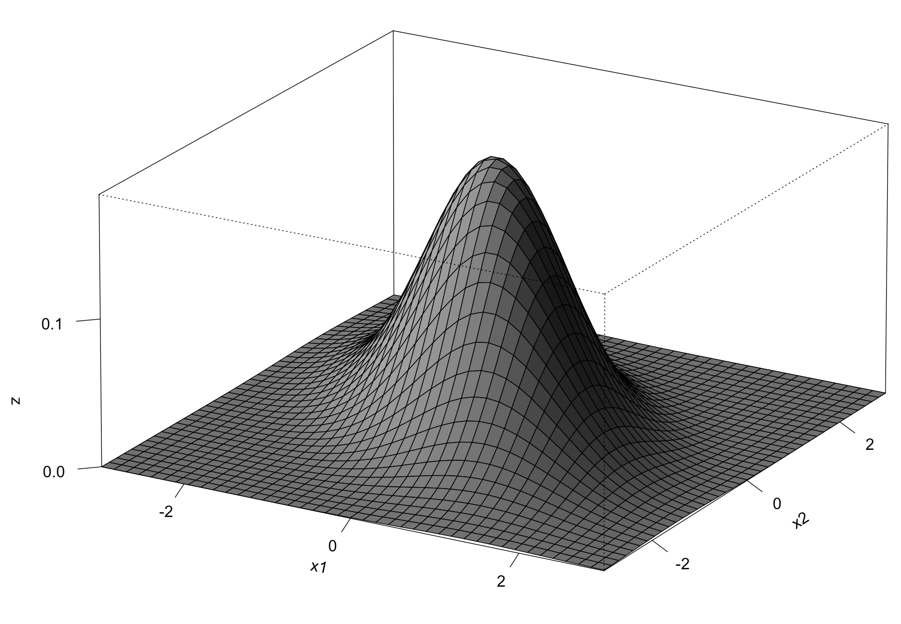

```{r,echo=FALSE,message=FALSE,warning=FALSE}
library(formatR)
library(tidyverse)
library(kableExtra)

# Set so that long lines in R will be wrapped:
knitr::opts_chunk$set(tidy.opts=list(width.cutoff=80), tidy=FALSE)
knitr::opts_chunk$set(cache=TRUE,warning=F)
knitr::opts_chunk$set(out.height='40%',fig.align = "center")
add.space = 0

# kable table global setup
kt = function(data) {
  kable(data, align = "c", escape = FALSE) %>%
    kable_styling(bootstrap_options = c("striped"),
                  latex_options = c("hold_position"))
}
```


# Multivariate Random Variables

These notes will explore pairs of random variables that may be related. To understand the relationship between these variables, we will start by defining joint probability distributions. Following that, we will examine the concepts of covariance and correlation to quantify and describe the nature of the relationship between the two variables.

## Joint Probability Distributions

:::{.definition}
Let $X$ and $Y$ be two discrete random variables defined on the sample space $\Omega$ of an experiment. The ***joint probability mass function***, $p(x,y)$, is defined for each pair of numbers (x,y) by: 

\[p(x,y) = P(X=x \text{ and } Y=y)\]

**Note:** $p(x,y) \geq 0$ and $\sum_x \sum_y p(x,y) = 1$
:::


:::{.definition}
Let $X$ and $Y$ be two continuous random variables defined on the sample space $\Omega$ of an experiment. The ***joint probability density function*** $f(x,y)$ for variables $X$ and $Y$ is a function satisfying: 

1. $f(x,y) \geq 0$ \
2. $\int_{-\infty}^{\infty} \int_{-\infty}^{\infty} f(x,y) dy dx = 1$ 
:::

**Note:** For any two-dimensional set A, $P((X,Y) \in A) = {\int \int}_A f(x,y) dy dx$.

**Note:** If A is a two-dimensional rectangle 

$\{(x,y): a \le x \le b, c \le y \le d\}$, then: \(P((X,Y) \in A) = \int_a^b \int_c^d f(x,y) dy dx\)


:::{.example} 
Let $f(x,y) = c xy, 0 \leq x,y \leq 1$. Find $c$ so that $f(x,y)$ is a valid joint pdf.
:::

\vfill


\newpage

## Marginal Probability Functions

:::{.definition}
The ***marginal probability mass function*** of a discrete random variable $X$ with joint pmf $p(x,y)$ is denoted by $p_X(x)$ and is given by: \(p_X(x) = \sum_y p(x,y)\)
:::

:::{.definition}
The ***marginal probability density function*** of a continuous random variable X with joint pdf $f(x,y)$ is denoted by $f_X(x)$ and is given by: \(f_X(x) = \int_y f(x,y) dy\)
:::

:::{.example} 
An apartment complex has the following joint distribution of $X$ bedrooms and $Y$ bathrooms. Determine the marginal pmfs and calculate the probability a randomly selected apartment has more bedrooms than bathrooms (i.e., $P(X>Y)$).
:::

```{r,echo=F,out.width="80%"}
# Create the data frame
data = data.frame(
  c("Y | X", 1, 2, 3, "$\\Sigma$"),
  c(1, 0.3, 0.3, 0, ""),
  c(2, 0, 0.3, 0.1, ""),
  c("$\\Sigma$", rep("", 4)))

data = t(data)
rownames(data) = NULL

# Render the table using kable with 'pipe' format
kt(data)
```

\newpage

:::{.example} 
Let $X$ and $Y$ have the joint pdf, $f(x,y)$, as follows. 
:::

$f(x,y) = \begin{cases} \frac{4}{3}(xy + x) & 0 \leq x \leq 1, 0 \leq y \leq 1\\
0 & \text{otherwise}
\end{cases}$
:::

(a) Confirm $f(x,y)$ is a valid pdf
(b) Determine the marginal pdfs
(c) Calculate $P(X<1/2,Y<1/2)$

\vfill

\newpage

## Independent Random Variables

:::{.definition}
Two discrete random variables are ***independent*** if $p(x,y) = p_X(x) \cdot p_Y(y)$.
:::

:::{.definition}
Two continuous random variables are ***independent*** if $f(x,y) = f_X(x) \cdot f_Y(y)$.
:::

:::{.definition}
If two random variables are not independent, they are ***dependent***.
:::

**Note:** You can also check independence by seeing if the conditional distribution equals the marginal distribution, i.e., $p_{Y|X}(y|x) = p_{Y}(y)$ OR $p_{X|Y}(x|y) = p_X(x)$.

:::{.example} 
Let $X$ and $Y$ have the joint pdf, $f(x)$, as follows. Are $X$ and $Y$ independent?
:::

$f(x,y) = \begin{cases} \frac{4}{3}(xy + x) & 0 \leq x \leq 1, 0 \leq y \leq 1\\
0 & \text{otherwise}
\end{cases}$

\vfill

:::{.example} 
An apartment complex has the following joint distribution of $X$ bedrooms and $Y$ bathrooms. Are $X$ and $Y$ independent?
:::

```{r,echo=F,out.width="80%"}
# Create the data frame
data = data.frame(
  c("Y | X", 1, 2, 3, "$\\Sigma$"),
  c(1, 0.3, 0.3, 0, ""),
  c(2, 0, 0.3, 0.1, ""),
  c("$\\Sigma$", rep("", 4)))

data = t(data)
rownames(data) = NULL

# Render the table using kable with 'pipe' format
kt(data)
```

\vfill

\newpage

## Conditional Distributions

:::{.definition}
Let $X$ and $Y$ be two discrete distributions with joint pmf $p(x,y)$ and marginal pmf of $X$ $p_X(x)$. Then for any $X$ value of $x$ for which $p_X(x) > 0$, the ***conditional probability mass function} of $Y$ given that $X=x$ is:
\[p_{Y|X}(y|x) = \frac{p(x,y)}{p_X(x)} \]
:::

:::{.definition}
Let $X$ and $Y$ be two continuous distributions with joint pdf $f(x,y)$ and marginal pdf of $X$ $f_X(x)$. Then for any $X$ value of $x$ for which $f_X(x) > 0$, the ***conditional probability density function} of $Y$ given that $X=x$ is:

\[f_{Y|X}(y|x) = \frac{f(x,y)}{f_X(x)} \]
:::

:::{.example} 
For the apartment example, determine the conditional pmf $p_{Y|X}(y|x=2)$. The joint pmf, $p_{X,Y}(x,y)$, is provided below.

```{r,echo=F,out.width="80%"}
# Create the data frame
data = data.frame(
  c("Y | X", 1, 2, 3, "$\\Sigma$"),
  c(1, 0.3, 0.3, 0, ""),
  c(2, 0, 0.3, 0.1, ""),
  c("$\\Sigma$", rep("", 4)))

data = t(data)
rownames(data) = NULL

# Render the table using kable with 'pipe' format
kt(data)
```

:::

\vfill

:::{.example} 
Let $X$ and $Y$ have the joint pdf, $f(x,y)$, as follows. Determine the conditional pdf, $f_{Y|X}(y|x)$.
:::

$f(x,y) = \begin{cases} \frac{4}{3}(xy + x) & 0 \leq x \leq 1, 0 \leq y \leq 1\\
0 & \text{otherwise}
\end{cases}$

\vfill \vfill

\newpage


## Expected Values, Covariance, and Correlation


:::{.theorem} 
Let X and Y be jointly distributed pmf $p(x,y)$ (if X and Y are discrete) or pdf $f(x,y)$ (if X and Y are continuous). The expected value of the function $h(X,Y)$, $E[h(X,Y)]$, is given by:

\[E[h(X,Y)] = \sum_x \sum_y h(x,y) \cdot p(x,y) \text{ (if X and Y are discrete)} \]

\[E[h(X,Y)] = \int_x \int_y h(x,y) \cdot f(x,y) dy dx \text{ (if X and Y are continuous)} \]
:::


:::{.definition}
The ***covariance*** between two random variables is given by: \[ Cov(X,Y) = E[XY] - E[X]E[Y]\]
:::

:::{.definition}
The ***correlation coefficient*** between two random variables is given by: \[Corr(X,Y) = \rho_{XY} = \rho = \frac{Cov(X,Y)}{\sigma_X \cdot \sigma_Y}\]

:::{.theorem} 
For any two random variables $X$ and $Y$, $-1 \le \rho_{XY} \le 1$.
:::

:::{.theorem} 
If $X$ and $Y$ are independent then $\rho_{XY} = 0$
:::

**Note:** $\rho_{XY} = 0$ does not imply that two random variables are independent!
:::

:::{.example} 
For the apartment example, determine $E[X]$, $E[Y]$, $E[XY]$, and $Cov(X,Y)$. The joint pmf, $p_{X,Y}(x,y)$, is provided below.
:::

```{r,echo=F,out.width="80%"}
# Create the data frame
data = data.frame(
  c("Y | X", 1, 2, 3, "$\\Sigma$"),
  c(1, 0.3, 0.3, 0, ""),
  c(2, 0, 0.3, 0.1, ""),
  c("$\\Sigma$", rep("", 4)))

data = t(data)
rownames(data) = NULL

# Render the table using kable with 'pipe' format
kt(data)
```

\vfill

:::{.theorem} 
Let X and Y be random variables and a and b be constants.

- $E[aX+bY] = aE[X] + bE[Y]$
- $Var(aX+bY) = a^2 Var(X) + b^2 Var(Y) + 2ab \cdot Cov(X,Y)$
- $Var(aX+bY) = a^2 Var(X) + b^2 Var(Y)$, if X and Y are independent
:::

\newpage

## Bivariate Normal Distribution


The ***bivariate normal distribution*** of ($X$,$Y$) has the following joint probability distribution function:

\[f(x,y) = \frac{1}{2 \pi \sigma_1 \sigma_2 \sqrt{1-\rho^2}} \cdot exp\Bigg[-\frac{1}{2(1-\rho^2)}\bigg(\Big(\frac{x-\mu_X}{\sigma_X}\bigg)^2 + 2 \rho \frac{(x-\mu_X)(y-\mu_Y)}{\sigma_1 \sigma_2} + \Big(\frac{y-\mu_Y}{\sigma_Y}\Big)^2 \bigg) \Bigg] \]

\[-\infty < x < \infty , -\infty < y < \infty\]

\smallskip

where $E[X] = \mu_X$, $Var(X) = \sigma_X^2$, $E[Y] = \mu_Y$, $Var(Y) = \sigma_Y^2$, $\rho = Corr(X,Y)$

{width=50%}

We won't work directly with the multivariate normal distribution, but there are some useful properties of normal random variables which we will use.

:::{.theorem} 
If $X \sim \mathcal{N}(\mu_X,\sigma^2_X)$ and $Y \sim \mathcal{N}(\mu_Y,\sigma^2_Y)$, then:
$X+Y \sim \mathcal{N}(\mu_X+\mu_Y,\sigma^2_X+\sigma^2_Y+2Cov(X,Y))$, that is, the sum of normal random variables is a normal random variable.
:::

:::{.theorem} 
If $X \sim \mathcal{N}(\mu_X,\sigma^2_X)$ and $Y \sim \mathcal{N}(\mu_Y,\sigma^2_Y)$ and X and Y are independent, then: $X+Y \sim \mathcal{N}(\mu_X+\mu_Y,\sigma^2_X+\sigma^2_Y)$.
:::

:::{.example}
Suppose $X$ and $Y$ are independent normal random variables with means $\mu_X=2$ and $\mu_Y=3$ and variances $\sigma_X^2=1$ and $\sigma_Y^2=4$. Determine the distribution of $Z = 4X-Y$.
:::

\vfill


\newpage

## R Companion for Chapter 5

:::{.example}
Let's return to the Hubble dataset. Let's load the dataset into R and then plot the data. Note the plot parameter **pch=16** fills in the data points for a nicer looking plot.
:::

```{r,warning=F,message=F}
hubble = read_csv(file = "hubble.csv")
plot(Velocity~Distance,data=hubble, pch=16)
```

There appears to be a positive relationship between Distance and Velocity. We can calculate the correlation and covariance between the two variables as well.

```{r}
cor(hubble$Distance,hubble$Velocity)
cov(hubble$Distance,hubble$Velocity)
```

The correlation is +0.789 indicating a positive, moderately strong linear relationship between Distance and Velocity. The covariance is 189.159 which is less interpretable since covariance is dependent on the units of measurement. For this reason, we typically prefer to use correlation rather than covariance.

\newpage

:::{.example}
The **mtcars** dataset is provided in the base version of R. To find out more info about this dataset, you can get details by calling **?mtcars**.
:::

```{r}
# get info on the mtcars dataset
?mtcars
```

In the side window of R Studio, it should display the following description after running **?mtcars**.

The data were extracted from the 1974 Motor Trend US magazine, and comprises fuel consumption and 10 aspects of automobile design and performance for 32 automobiles (1973–74 models).

Let's load the dataset and take a look at the first few values.

```{r}
data(mtcars)
head(mtcars)
```

In the code below, we extract just these two variables from **mtcars** and create a new variable **m**. From this new variable **m**, we can construct a two-way table of counts for the combinations of **cyl** and **gear**.

```{r}
# construct a two-way table of counts for cyl and gear
m.table = table(mtcars$cyl, mtcars$gear)
m.table
```

\newpage

We can also construct the joint probability mass function by dividing our table by the total number of observations.

```{r}
# calculate the number of total observations
n = sum(m.table); n

# construct the joint pmf
m.pmf = m.table/n; m.pmf
```

Using the table, we can see that P(gear=3 and cyl=8) = 0.375 for example. What is P(gear=4 and cylinder = 4)? The middle entry of the table tells us this value is 0.125. In other words, 12.5\% of the cars in this dataset have 4 gears and 4 cylinders.

Next, we are going to look at the joint probability mass function (PMF) of the variables **cyl} and **gear}. We can get the marginal PMFs by summing across rows and columns of the joint pmf.

```{r}
# marginal pmf of gear
colSums(m.pmf)

# marginal pmf of cyl
rowSums(m.pmf)
```

From the tables above, you should see that P(gear=3)=0.46875 and P(cyl=4)=0.34375.

Finally, we can get the correlation as follows. Note that gear and cyl have a negative, moderate linear relationship.

```{r}
cor(mtcars$cyl,mtcars$gear)
```
